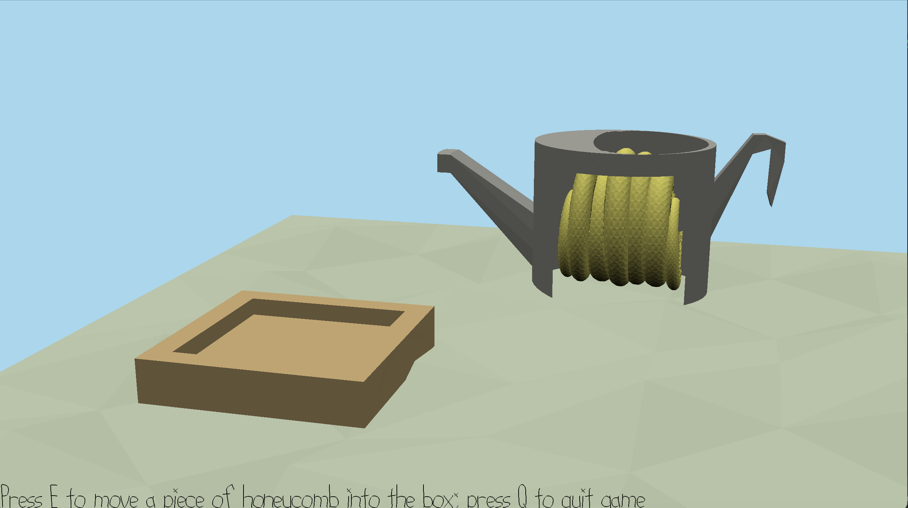

# The Bee Move-E

Author: Nellie Tonev

Design: Have you ever watched the fascinating process of a beekeeper relocating a bee colony and their hive and wished 
that you could try it out yourself (without the risk of getting stung, of course)?
Well, now you can (in an extremely simplified and low-poly way)! 

Screen Shot:

How To Play:
* Press 'E' to move piece of honeycomb from the watering can to the target box.
* Press 'Q' to quit the game.

\
This game was built with [NEST](NEST.md).
